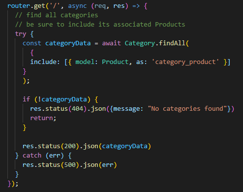
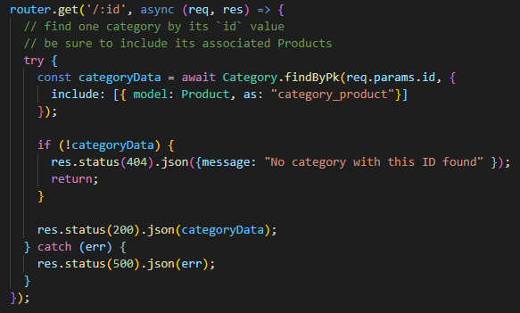
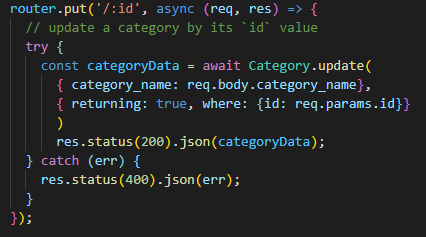
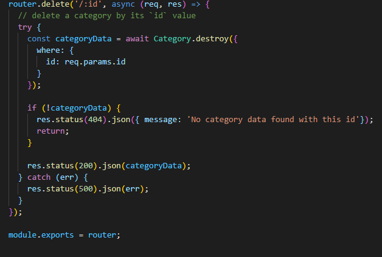

# E-commerce Backend

[Description](#description) 

[Installation Instructions](#installation-instructions) 

[Site Overview](#site-overview) 
  

[Contribution Guidelines](#contribution-guidelines) 

[Tests](#tests) 
 
[Questions](#questions)

# Description

This application sets up a functional backend for a website that a user could utilize for e-commerce, where they can manipulate their database using Javascript, Express.js, and node modules such as Sequelize to interact with a MySQL database.

## Installation Instructions

If you would like to install this application, all you need to do is clone or fork it from the repository listed at the top of this page.  Once you have it on your local device, you can run a NPM install to ensure that all of the node modules are functional.  Then, simply start the application with an npm start.  

## Site Overview

This application functions only as a backend, where the database can be managed through a series of different API calls.  The user can view, update, add and delete elements from the database through making API calls to the appropriate route as is displayed in the following videos.

[Click here to see a video on the technical components of the application!](https://drive.google.com/file/d/1A1uL5vFVlLFWARemnxgzOiW6PrcBZlKR/view)

[Click here to see a video on how to set up the database and seed it!](https://drive.google.com/file/d/1_cwaBuzeOFWIXP1tzsD-tj8qP3ETeHya/view)

[Click here to see a video on how to use the app using Insomnia Core!](https://drive.google.com/file/d/1ANge8UCk1OfOPrP5VXkrDwHx-4itW0V6/view)

In order for the user to get all of the information in a particular column of the database, the get api call get request can be run on that particular column " http://localhost:3001/api/categories/ " for example, and the function utilizes sequelize to perform a .findAll() including the relevant information such as associated foreign keys.

If the user wants to get just a particular object from that array of objects, they can search by the primary key using the api call get request " http://localhost:3001/api/categories/{id} ".  The function in the application will use sequelize method .findByPk to find the particular object by its primary key established in the model.

If the user wanted to update an object in the database, they can do so in a similar fashion by targeting it " http://localhost:3001/api/categories/{id} " but as a PUT request instead, and then entering in the information they want to change in json format.  An example of this can be better seen in the video above.  

Finally, delete is fairly similar to update except instead of running a put request on " http://localhost:3001/api/categories/{id} ", you would have to run a delete request.  In this instance, the category with that particular id would be removed from the database.  

## License

This application uses the MIT license

## Contribution Guidelines

If you would like to contribute to this project feel free to send requests.  I only wish that you be respectful to other contributes and to the code itself and maintain good clean coding practices. 

### Questions

If you have any questions about the application, be sure to contact me at my [e-mail](mailto:SeppalaErin98@gmail.com).

Alternatively you can find me and my other works at my [Github account](https://github.com/aseppala98).